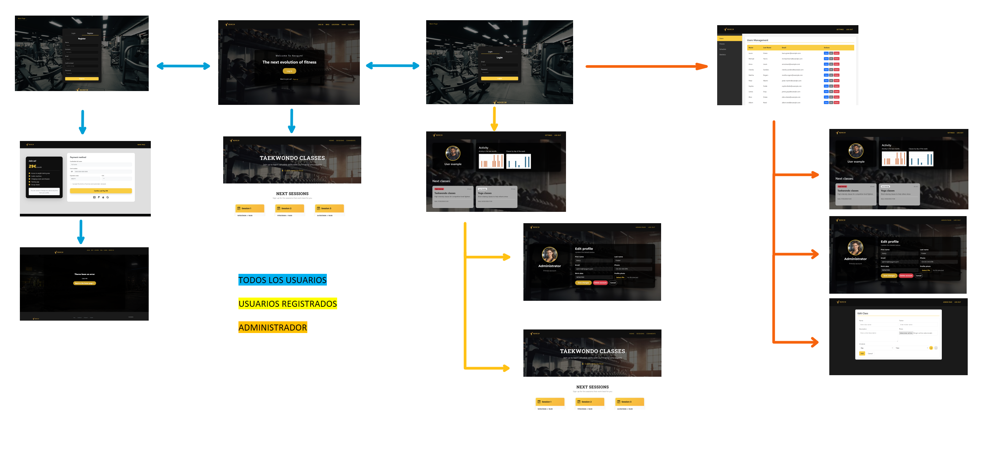
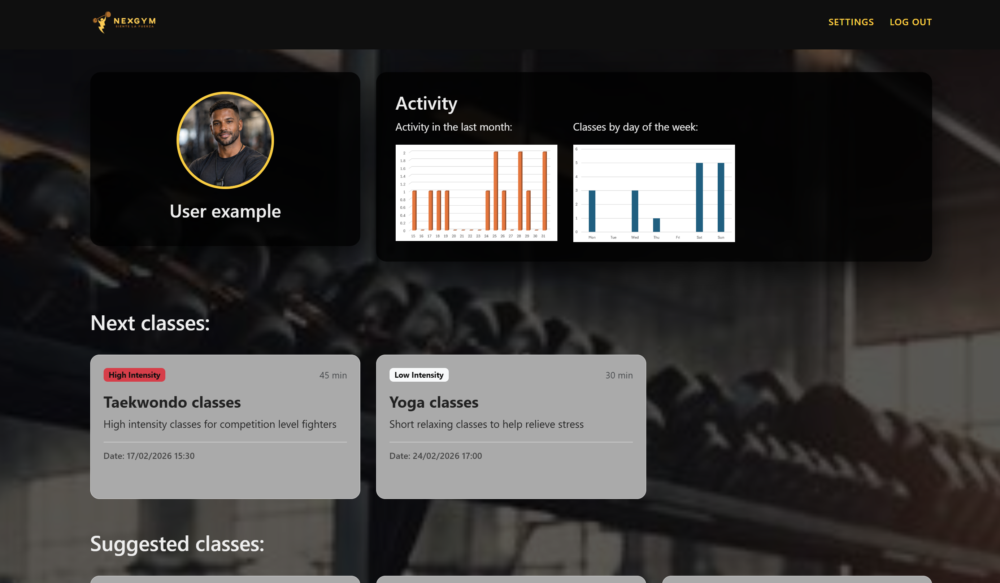
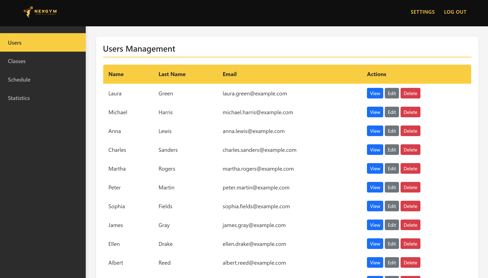
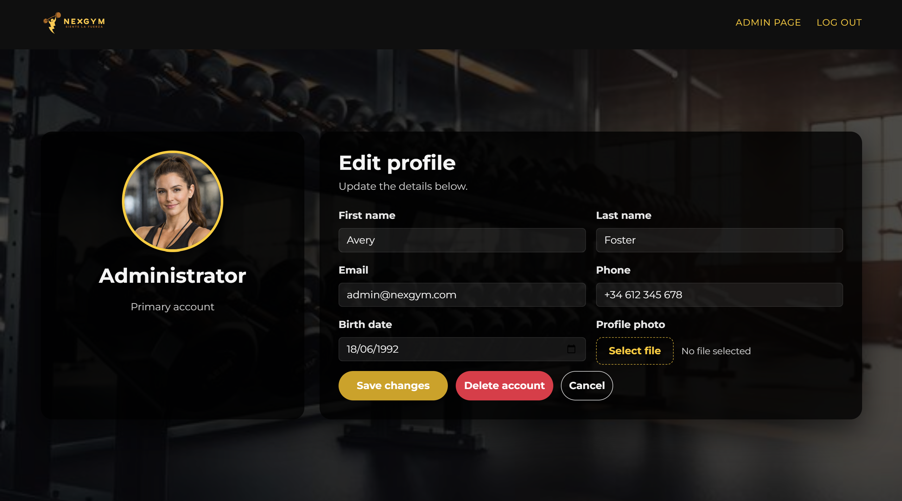
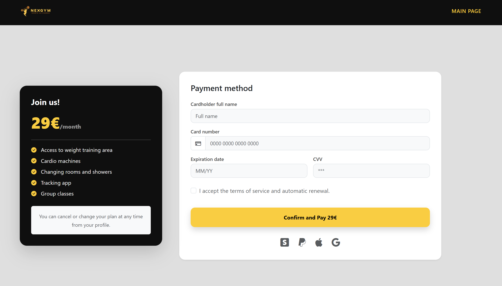
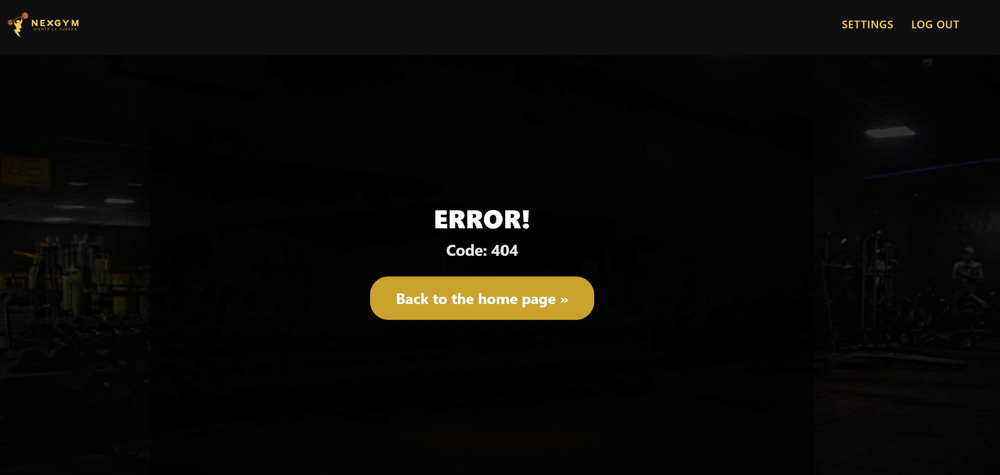
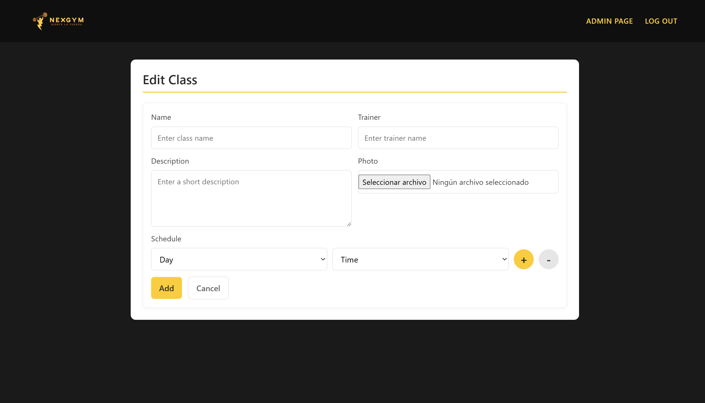

# NEXGYM

## 👥 Miembros del Equipo
| Nombre y Apellidos | Correo URJC | Usuario GitHub |
|:--- |:--- |:--- |
| Delia Martínez López | d.martinezl.2022@alumnos.urjc.es | deliaml10 |
| Rubén Ruiz Martín | r.ruizm.2023@alumnos.urjc.es | ruben730 |
| Rodrigo Fernández de Córdoba García | r.fernandezgar.2023@alumnos.urjc.es | RodrigoFDCG |

---

## 🎭 **Preparación 1: Definición del Proyecto**

### **Descripción del Tema**
Aplicación web del sector fitness destinada a la gestión de un gimnasio. Permite a los usuarios registrarse, consultar clases y horarios e inscribirse en actividades, mientras que el gimnasio puede organizar su oferta y controlar aforos. Aporta una gestión más eficiente y una experiencia más cómoda para los usuarios.


### **Entidades**
Indicar las entidades principales que gestionará la aplicación y las relaciones entre ellas:

1. **Entidad 1**: Usuarios
2. **Entidad 2**: Comentarios de las clases 
3. **Entidad 3**: Sesión de clase 
4. **Entidad 4**: Clases 

**Relaciones entre entidades:**
- Usuario - Sesión: un usuario puede asistir a varias sesiones y a una sesión pueden asistir varios usuarios. (N:M)
- Clase - Sesiones: una clase puede tener varias sesiones, pero una sesión solo puede pertenecer a una clase. (1:N)
- Clase - Comentario: un comentario pertenece a una clase, pero una clase puede tener varios comentarios. (1:N)
- Usuario - Comentario: un usuario puede hacer tantos comentarios como quiera, pero un comentario pertenece a un usuario. (1:N)

### **Permisos de los Usuarios**
Describir los permisos de cada tipo de usuario e indicar de qué entidades es dueño:

* **Usuario Anónimo**: 
  - Permisos: visualizar la información pública del gimnasio, consultar las clases y horarios disponibles en cada gimnasio y registrarse/iniciar sesión en la plataforma. 
  - No es dueño de ninguna entidad

* **Usuario Registrado**: 
  - Permisos: gestionar su perfil personal, incribirse y cancelar de una sesión, concultar los horarios de las clases a las que se ha apuntado y visualizar el gimnasio al que pertenece. 
  - Es dueño de: su perfil de usuario, sus comentarios de las clases. 

* **Administrador**: 
  - Permisos: gestión completa usuarios, clases, sesiones y comentarios. 
  - Es dueño de: clases y sesiones.

### **Imágenes**
Indicar qué entidades tendrán asociadas una o varias imágenes:

- **[Entidad con imágenes 1]**: Usuario: imagen de perfil.
- **[Entidad con imágenes 2]**: Clases: carrusel de imágenes de la actividad que se realiza en la clase. 

### **Gráficos**
Indicar qué información se mostrará usando gráficos y de qué tipo serán:

- **Gráfico 1**: Cantidad de usuarios apuntados a una clase según el horario - gráfico de barras.
- **Gráfico 2**: Clases atendidas por mes de un usuario - gráfico de barras. 

### **Tecnología Complementaria**
Indicar qué tecnología complementaria se empleará:

- Mapa con la localización del gimnasio.
- Envío de un correo de confirmación de cuenta al usuario tras registrarse en la plataforma.
- Envío de un correo de confirmación al usuario tras apuntarse a una sesión.  


### **Algoritmo o Consulta Avanzada**
Indicar cuál será el algoritmo o consulta avanzada que se implementará:

* **Algoritmo/Consulta**: Detección de solapamientos de clases. 
   - **Descripción**: El usuario no podrá reservar dos clases distintas en el mismo horario. 


* **Algoritmo/Consulta**: Creación automática de sesiones.  
   - **Descripción**: Cuando el administrador crea una clase, se tienen que guardar las sesiones de esa clase para un año. 


* **Algoritmo/Consulta**: Sugerir clases en función de la hora a la que suele ir un usuario.
   - **Descripción**: Los usuarios podrán ver sugerencias de distintas clases en función de la hora a la que suelen reservar. 

---
## 🛠 **Práctica 1: Maquetación de páginas web con HTML y CSS**

### **Diagrama de Navegación**
Diagrama que muestra cómo se navega entre las diferentes páginas de la aplicación:



> Todos los usuarios entran a la página principal, desde donde pueden ver la información de las clases, iniciar sesión, registrarse en la web rellenando un formulario y haciendo el pago. 
> Los usuarios registrados, una vez han hecho el inicio de sesión, pueden acceder a su página de perfil, donde pueden ver las estadísticas de las clases a las que han ido, las clases a las que están apuntados, todas las clases que hay en el gimnasio y una fila de sugerencias de clases a las que pueden apuntarse. Desde esta página pueden acceder a la página de clase (desde donde se apuntarán y podrán ver los comentarios) y a su página de configuración, donde pueden cambiar la información que hay guardada sobre ellos.
> Un administrador, una vez ha iniciado sesión, se le redirige a la página de administrador donde puede ver información y estadísticas de todo el gimnasio. En la sección de usuarios podrá ver una tabla de todos los usuarios que hay registrados en el gimnasio, podrá ver sus perfiles, editarlos y borrarlos. En la sección de clases podrá ver, editar y borrar las clases. En la sección de horarios, podrá editar o borrar el horario de una clase. También podrá ver estadísticas generales de cada clase en la sección de estadísticas. 

### **Capturas de Pantalla y Descripción de Páginas**

### **Capturas de Pantalla y Descripción de Páginas**

#### 1. Página Principal

> Página de inicio desde la que se puede acceder a la página de iniciar sesión/registrarse, ver las clases disponibles (y su información) , información general sobre el ginmasio y un mapa de su ubicación. 

#### 2. Log-in / Registro

> Página de registro / inicio de sesión donde los usuarios pueden rellenar un formulario y acceder a las funciones de la página. 

#### 3. Perfil usuario

> Página de perfil de usuario donde un usuario puede ver sus estadísticas, las clases a las que está apuntado, sugerencias de clases, todas las clases que hay en el gimnasio y acceder a las páginas de clase y editar perfil. 

#### 4. Página administrador

> Página de administrador desde donde un usuario administrador puede ver los datos del gimnasio (usuarios apuntados, clases disponibles, horario de cada clase y estadísticas), modificarlos y borrarlos; además de crear clases u horarios. También puede acceder a su perfil o cerrar sesión. 

#### 5. Perfil administrador 

> Página de perfil de administrador donde se encuentra un formulario para que el administrador pueda cambiar los datos asociados a su cuenta. 

#### 6. Pagina de pago 

> Página de pago en la que un usuario puede rellenar el formulario sobre los datos de su tarjeta para pagar la suscripción del gimnasio. 

#### 7. Pagina de error 

> Página de error que se muestra cuando el usuario no ha podido realizar correctamente el pago o intenta acceder a algún apartado al que no esta autorizado. 

#### 8. Pagina de clase 

> Página de clase en la que se puede ver la información de una clase (breve descripción, aforo, entrenador y sesiones disponibles). Además, hay un apartado de comentarios que dejan los propios usuarios sobre la clase. 

#### 9. Página de nueva clase / editar clase 

> Página para añadir o editar clases a la que solo tiene acceso un administrador. Aquí podrá crear una nueva clase o (si accede desde el botón de editar clase o editar horario) podrá mofidicar la información que ya existe de una clase concreta. 
### **Participación de Miembros en la Práctica 1**

#### **Alumno 1 - Delia Martínez López**

He realizado la implementación de la página de inicio de sesión / registro, la página de administrador y la de creación / modificación de clases, con todos sus estilos y funcionalidades de javaScript. 

| Nº    | Commits      | Files      |
|:------------: |:------------:| :------------:|
|1| Logic and information of the Admin site  | [URL_archivo_1](https://github.com/CodeURJC-DAW-2025-26/practica-daw-2025-26-grupo-17/tree/83bafd366713cc6597a15f34ea86a683bd7eae36)  |
|2| Creation of the login/register website   | [URL_archivo_2](https://github.com/CodeURJC-DAW-2025-26/practica-daw-2025-26-grupo-17/tree/9f0885944270a84acc3eca7f3775d63e74cb4590)   |
|3| Creation of the administrator site  |[URL_archivo_3](https://github.com/CodeURJC-DAW-2025-26/practica-daw-2025-26-grupo-17/tree/613d0e9d6a466d894902696ca090158406452617)   |
|4| Creation of a new class   | [URL_archivo_4](https://github.com/CodeURJC-DAW-2025-26/practica-daw-2025-26-grupo-17/tree/8b3028994af805fffdb92fcaf20677b845d888b2)   |
|5| Finished profile site   | [URL_commit_5](https://github.com/CodeURJC-DAW-2025-26/practica-daw-2025-26-grupo-17/tree/568ecccdef1dff2f81983820f24f605c53b1d91d)   |

---

#### **Alumno 2 - Rubén Ruiz Martín**

He desarrollado las páginas Index, Payment y Class, encargándome de la implementación completa en HTML, CSS y JavaScript. Además, he utilizado Bootstrap para mejorar el diseño y la experiencia visual mediante el estilizado de botones, tablas y otros componentes.

| Nº    | Commits      | Files      |
|:------------: |:------------:| :------------:|
|1| Creation of the class page (HTML, CSS) | [URL_commit_1](https://github.com/CodeURJC-DAW-2025-26/practica-daw-2025-26-grupo-17/commit/7fdc7d18bcf58870e1301e3cffd48cb53136165b#diff-182b27b78e79493cae10e5617c7d775b441aa85e0a24c6940938a8d49eeac3f1)   |
|2| Creation of the index (main) website (HTML, CSS) | [URL_commit_2](https://github.com/CodeURJC-DAW-2025-26/practica-daw-2025-26-grupo-17/commit/f0797e1a8c9bf3fb8de4235abb5a149611d60037)   |
|3| Creation of the carousel of images of class page (HTML, CSS, JS) | [URL_commit_3](https://github.com/CodeURJC-DAW-2025-26/practica-daw-2025-26-grupo-17/commit/69c3ce510761de30bc31d5cec36a3a66da9f41d9)   |
|4| Creation of the payment page (HTML, CSS) | [URL_commit_4](https://github.com/CodeURJC-DAW-2025-26/practica-daw-2025-26-grupo-17/commit/f22eb92e3a1d8a80fc3764e58411bacf53881d53)   |
|5| Changes for responsiveness in index page | [URL_commit_5](https://github.com/CodeURJC-DAW-2025-26/practica-daw-2025-26-grupo-17/commit/578f2db6d664334e34e9b64adc044a04adce67a2#diff-c4b028e49bbffb4c84bcdf62d72799492e34bef674b38728c5bc23be37765d3d)   |

---

#### **Alumno 3 - Rodrigo Fernández de Córdoba García**

[Descripción de las tareas y responsabilidades principales del alumno en el proyecto]

| Nº    | Commits      | Files      |
|:------------: |:------------:| :------------:|
|1| Starting commit, added new pages for class and error with their css  | [URL_commit_1](https://github.com/CodeURJC-DAW-2025-26/practica-daw-2025-26-grupo-17/commit/3a4010222b197fbd51d7070075f03b601423ec34)   |
|2| Big changes to profile, error and class pages; separated their css for clarity, translated text to english and added the navbar and missing styles  | [URL_commit_2](https://github.com/CodeURJC-DAW-2025-26/practica-daw-2025-26-grupo-17/commit/67f36d6fa3cb1e27e31a7d03849a56761bce0dd5)   |
|3| Added the classes to the profile page, added the comments and comment form to the class page and fixed the error page footer | [URL_commit_3](https://github.com/CodeURJC-DAW-2025-26/practica-daw-2025-26-grupo-17/commit/acc628c304f265b63b5015f04a33179692745cff)   |
|4| Changed profile and class pages to use bootstrap 5.3.0 from 3.1.0 to be in line with the rest of the pages | [URL_commit_4](https://github.com/CodeURJC-DAW-2025-26/practica-daw-2025-26-grupo-17/commit/ddd31013202ae15e6f9b98f94bd6f21a16923ae1)   |
|5| Edited just about every CSS to remove their individual navbar CSS styles and added to every html the headerCSS stylesheet to keep a common header style across pages  | [URL_commit_5]https://github.com/CodeURJC-DAW-2025-26/practica-daw-2025-26-grupo-17/commit/bfdc7243029c22a771aebebb24f74129dc8a5ab8#diff-182b27b78e79493cae10e5617c7d775b441aa85e0a24c6940938a8d49eeac3f1 |

---


## 🛠 **Práctica 2: Web con HTML generado en servidor**

### **Navegación y Capturas de Pantalla**

#### **Diagrama de Navegación**

Solo si ha cambiado.

#### **Capturas de Pantalla Actualizadas**

Solo si han cambiado.

### **Instrucciones de Ejecución**

#### **Requisitos Previos**
- **Java**: versión 21 o superior
- **Maven**: versión 3.8 o superior
- **MySQL**: versión 8.0 o superior
- **Git**: para clonar el repositorio

#### **Pasos para ejecutar la aplicación**

1. **Clonar el repositorio**
   ```bash
   git clone https://github.com/[usuario]/[nombre-repositorio].git
   cd [nombre-repositorio]
   ```

2. **AQUÍ INDICAR LO SIGUIENTES PASOS**

#### **Credenciales de prueba**
- **Usuario Admin**: usuario: `admin`, contraseña: `admin`
- **Usuario Registrado**: usuario: `user`, contraseña: `user`

### **Diagrama de Entidades de Base de Datos**

Diagrama mostrando las entidades, sus campos y relaciones:


> [Descripción opcional: Ej: "El diagrama muestra las 4 entidades principales: Usuario, Producto, Pedido y Categoría, con sus respectivos atributos y relaciones 1:N y N:M."]

### **Diagrama de Clases y Templates**

Diagrama de clases de la aplicación con diferenciación por colores o secciones:


> [Descripción opcional del diagrama y relaciones principales]

### **Participación de Miembros en la Práctica 2**

#### **Alumno 1 - [Nombre Completo]**

[Descripción de las tareas y responsabilidades principales del alumno en el proyecto]

| Nº    | Commits      | Files      |
|:------------: |:------------:| :------------:|
|1| [Descripción commit 1](URL_commit_1)  | [Archivo1](URL_archivo_1)   |
|2| [Descripción commit 2](URL_commit_2)  | [Archivo2](URL_archivo_2)   |
|3| [Descripción commit 3](URL_commit_3)  | [Archivo3](URL_archivo_3)   |
|4| [Descripción commit 4](URL_commit_4)  | [Archivo4](URL_archivo_4)   |
|5| [Descripción commit 5](URL_commit_5)  | [Archivo5](URL_archivo_5)   |

---

#### **Alumno 2 - [Nombre Completo]**

[Descripción de las tareas y responsabilidades principales del alumno en el proyecto]

| Nº    | Commits      | Files      |
|:------------: |:------------:| :------------:|
|1| [Descripción commit 1](URL_commit_1)  | [Archivo1](URL_archivo_1)   |
|2| [Descripción commit 2](URL_commit_2)  | [Archivo2](URL_archivo_2)   |
|3| [Descripción commit 3](URL_commit_3)  | [Archivo3](URL_archivo_3)   |
|4| [Descripción commit 4](URL_commit_4)  | [Archivo4](URL_archivo_4)   |
|5| [Descripción commit 5](URL_commit_5)  | [Archivo5](URL_archivo_5)   |

---

#### **Alumno 3 - [Nombre Completo]**

[Descripción de las tareas y responsabilidades principales del alumno en el proyecto]

| Nº    | Commits      | Files      |
|:------------: |:------------:| :------------:|
|1| [Descripción commit 1](URL_commit_1)  | [Archivo1](URL_archivo_1)   |
|2| [Descripción commit 2](URL_commit_2)  | [Archivo2](URL_archivo_2)   |
|3| [Descripción commit 3](URL_commit_3)  | [Archivo3](URL_archivo_3)   |
|4| [Descripción commit 4](URL_commit_4)  | [Archivo4](URL_archivo_4)   |
|5| [Descripción commit 5](URL_commit_5)  | [Archivo5](URL_archivo_5)   |

---

#### **Alumno 4 - [Nombre Completo]**

[Descripción de las tareas y responsabilidades principales del alumno en el proyecto]

| Nº    | Commits      | Files      |
|:------------: |:------------:| :------------:|
|1| [Descripción commit 1](URL_commit_1)  | [Archivo1](URL_archivo_1)   |
|2| [Descripción commit 2](URL_commit_2)  | [Archivo2](URL_archivo_2)   |
|3| [Descripción commit 3](URL_commit_3)  | [Archivo3](URL_archivo_3)   |
|4| [Descripción commit 4](URL_commit_4)  | [Archivo4](URL_archivo_4)   |
|5| [Descripción commit 5](URL_commit_5)  | [Archivo5](URL_archivo_5)   |

---

## 🛠 **Práctica 3: API REST, docker y despliegue**

### **Documentación de la API REST**

#### **Especificación OpenAPI**
📄 **[Especificación OpenAPI (YAML)](/api-docs/api-docs.yaml)**

#### **Documentación HTML**
📖 **[Documentación API REST (HTML)](https://raw.githack.com/[usuario]/[repositorio]/main/api-docs/api-docs.html)**

> La documentación de la API REST se encuentra en la carpeta `/api-docs` del repositorio. Se ha generado automáticamente con SpringDoc a partir de las anotaciones en el código Java.

### **Diagrama de Clases y Templates Actualizado**

Diagrama actualizado incluyendo los @RestController y su relación con los @Service compartidos:


### **Instrucciones de Ejecución con Docker**

#### **Requisitos previos:**
- Docker instalado (versión 20.10 o superior)
- Docker Compose instalado (versión 2.0 o superior)

#### **Pasos para ejecutar con docker-compose:**

1. **Clonar el repositorio** (si no lo has hecho ya):
   ```bash
   git clone https://github.com/[usuario]/[repositorio].git
   cd [repositorio]
   ```

2. **AQUÍ LOS SIGUIENTES PASOS**:

### **Construcción de la Imagen Docker**

#### **Requisitos:**
- Docker instalado en el sistema

#### **Pasos para construir y publicar la imagen:**

1. **Navegar al directorio de Docker**:
   ```bash
   cd docker
   ```

2. **AQUÍ LOS SIGUIENTES PASOS**

### **Despliegue en Máquina Virtual**

#### **Requisitos:**
- Acceso a la máquina virtual (SSH)
- Clave privada para autenticación
- Conexión a la red correspondiente o VPN configurada

#### **Pasos para desplegar:**

1. **Conectar a la máquina virtual**:
   ```bash
   ssh -i [ruta/a/clave.key] [usuario]@[IP-o-dominio-VM]
   ```
   
   Ejemplo:
   ```bash
   ssh -i ssh-keys/app.key vmuser@10.100.139.XXX
   ```

2. **AQUÍ LOS SIGUIENTES PASOS**:

### **URL de la Aplicación Desplegada**

🌐 **URL de acceso**: `https://[nombre-app].etsii.urjc.es:8443`

#### **Credenciales de Usuarios de Ejemplo**

| Rol | Usuario | Contraseña |
|:---|:---|:---|
| Administrador | admin | admin123 |
| Usuario Registrado | user1 | user123 |
| Usuario Registrado | user2 | user123 |

### **OTRA DOCUMENTACIÓN ADICIONAL REQUERIDA EN LA PRÁCTICA**

### **Participación de Miembros en la Práctica 3**

#### **Alumno 1 - [Nombre Completo]**

[Descripción de las tareas y responsabilidades principales del alumno en el proyecto]

| Nº    | Commits      | Files      |
|:------------: |:------------:| :------------:|
|1| [Descripción commit 1](URL_commit_1)  | [Archivo1](URL_archivo_1)   |
|2| [Descripción commit 2](URL_commit_2)  | [Archivo2](URL_archivo_2)   |
|3| [Descripción commit 3](URL_commit_3)  | [Archivo3](URL_archivo_3)   |
|4| [Descripción commit 4](URL_commit_4)  | [Archivo4](URL_archivo_4)   |
|5| [Descripción commit 5](URL_commit_5)  | [Archivo5](URL_archivo_5)   |

---

#### **Alumno 2 - [Nombre Completo]**

[Descripción de las tareas y responsabilidades principales del alumno en el proyecto]

| Nº    | Commits      | Files      |
|:------------: |:------------:| :------------:|
|1| [Descripción commit 1](URL_commit_1)  | [Archivo1](URL_archivo_1)   |
|2| [Descripción commit 2](URL_commit_2)  | [Archivo2](URL_archivo_2)   |
|3| [Descripción commit 3](URL_commit_3)  | [Archivo3](URL_archivo_3)   |
|4| [Descripción commit 4](URL_commit_4)  | [Archivo4](URL_archivo_4)   |
|5| [Descripción commit 5](URL_commit_5)  | [Archivo5](URL_archivo_5)   |

---

#### **Alumno 3 - [Nombre Completo]**

[Descripción de las tareas y responsabilidades principales del alumno en el proyecto]

| Nº    | Commits      | Files      |
|:------------: |:------------:| :------------:|
|1| [Descripción commit 1](URL_commit_1)  | [Archivo1](URL_archivo_1)   |
|2| [Descripción commit 2](URL_commit_2)  | [Archivo2](URL_archivo_2)   |
|3| [Descripción commit 3](URL_commit_3)  | [Archivo3](URL_archivo_3)   |
|4| [Descripción commit 4](URL_commit_4)  | [Archivo4](URL_archivo_4)   |
|5| [Descripción commit 5](URL_commit_5)  | [Archivo5](URL_archivo_5)   |

---

#### **Alumno 4 - [Nombre Completo]**

[Descripción de las tareas y responsabilidades principales del alumno en el proyecto]

| Nº    | Commits      | Files      |
|:------------: |:------------:| :------------:|
|1| [Descripción commit 1](URL_commit_1)  | [Archivo1](URL_archivo_1)   |
|2| [Descripción commit 2](URL_commit_2)  | [Archivo2](URL_archivo_2)   |
|3| [Descripción commit 3](URL_commit_3)  | [Archivo3](URL_archivo_3)   |
|4| [Descripción commit 4](URL_commit_4)  | [Archivo4](URL_archivo_4)   |
|5| [Descripción commit 5](URL_commit_5)  | [Archivo5](URL_archivo_5)   |

---
