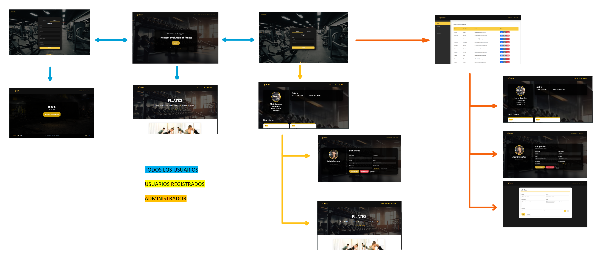
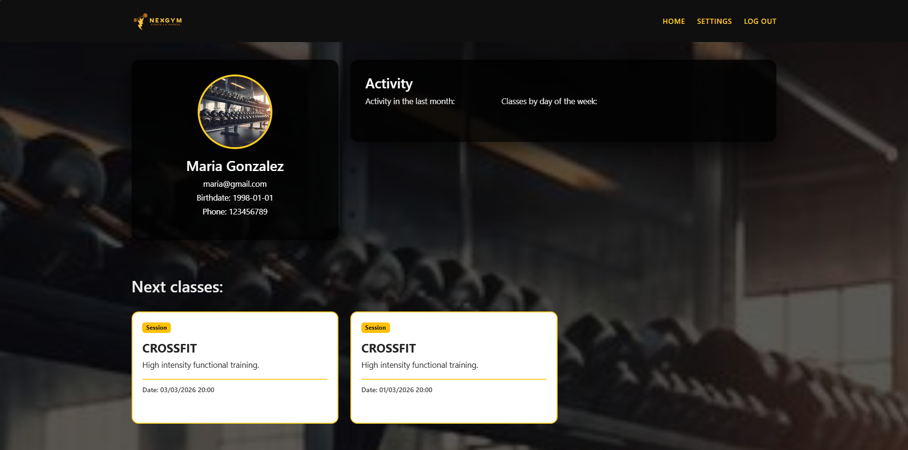
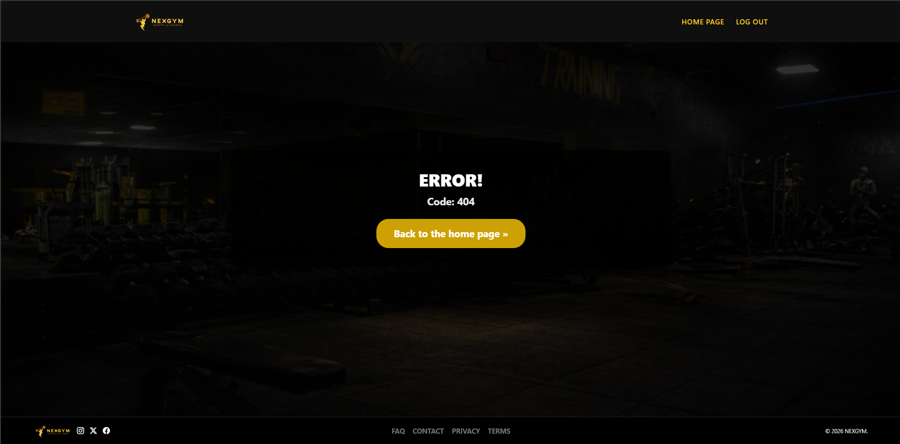
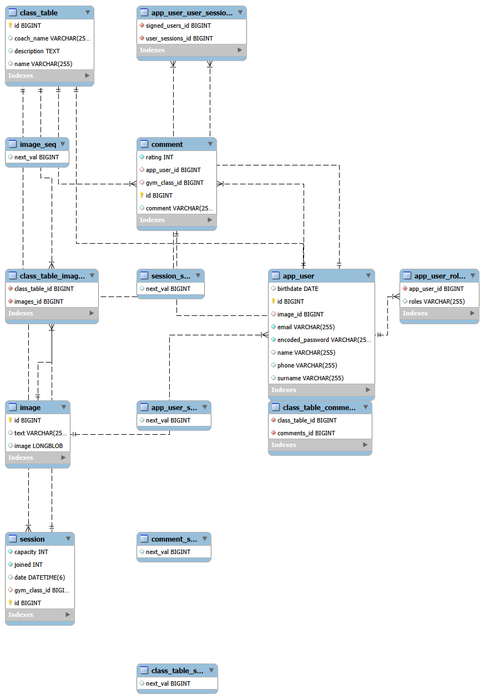
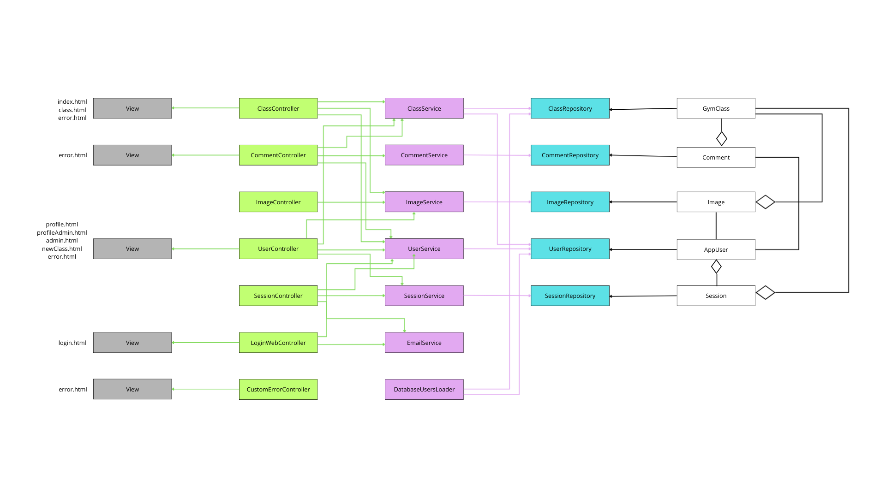

# NEXGYM

## 👥 Miembros del Equipo

| Nombre y Apellidos                  | Correo URJC                         | Usuario GitHub |
| :---------------------------------- | :---------------------------------- | :------------- |
| Delia Martínez López                | d.martinezl.2022@alumnos.urjc.es    | deliaml10      |
| Rubén Ruiz Martín                   | r.ruizm.2023@alumnos.urjc.es        | ruben730       |
| Rodrigo Fernández de Córdoba García | r.fernandezgar.2023@alumnos.urjc.es | RodrigoFDCG    |

---

## 🎭 **Preparación 1: Definición del Proyecto**

### **Descripción del Tema**

Aplicación web del sector fitness destinada a la gestión de un gimnasio. Permite a los usuarios registrarse, consultar clases y horarios e inscribirse en actividades, mientras que el gimnasio puede organizar su oferta y controlar aforos. Aporta una gestión más eficiente y una experiencia más cómoda para los usuarios.

### **Entidades**

Indicar las entidades principales que gestionará la aplicación y las relaciones entre ellas:

1. **Entidad 1**: Usuarios
2. **Entidad 2**: Comentarios de las clases
3. **Entidad 3**: Sesión de clase
4. **Entidad 4**: Clases

**Relaciones entre entidades:**

- Usuario - Sesión: un usuario puede asistir a varias sesiones y a una sesión pueden asistir varios usuarios. (N:M)
- Clase - Sesiones: una clase puede tener varias sesiones, pero una sesión solo puede pertenecer a una clase. (1:N)
- Clase - Comentario: un comentario pertenece a una clase, pero una clase puede tener varios comentarios. (1:N)
- Usuario - Comentario: un usuario puede hacer tantos comentarios como quiera, pero un comentario pertenece a un usuario. (1:N)

### **Permisos de los Usuarios**

Describir los permisos de cada tipo de usuario e indicar de qué entidades es dueño:

- **Usuario Anónimo**:
  - Permisos: visualizar la información pública del gimnasio, consultar las clases y horarios disponibles en cada gimnasio y registrarse/iniciar sesión en la plataforma.
  - No es dueño de ninguna entidad

- **Usuario Registrado**:
  - Permisos: gestionar su perfil personal, incribirse y cancelar de una sesión, concultar los horarios de las clases a las que se ha apuntado y visualizar el gimnasio al que pertenece.
  - Es dueño de: su perfil de usuario, sus comentarios de las clases.

- **Administrador**:
  - Permisos: gestión completa usuarios, clases, sesiones y comentarios.
  - Es dueño de: clases y sesiones.

### **Imágenes**

Indicar qué entidades tendrán asociadas una o varias imágenes:

- **[Entidad con imágenes 1]**: Usuario: imagen de perfil.
- **[Entidad con imágenes 2]**: Clases: carrusel de imágenes de la actividad que se realiza en la clase.

### **Gráficos**

Indicar qué información se mostrará usando gráficos y de qué tipo serán:

- **Gráfico 1**: Cantidad de usuarios apuntados a una clase según el horario - gráfico de barras.
- **Gráfico 2**: Clases atendidas por mes de un usuario - gráfico de barras.

### **Tecnología Complementaria**

Indicar qué tecnología complementaria se empleará:

- Mapa con la localización del gimnasio.
- Envío de un correo de confirmación de cuenta al usuario tras registrarse en la plataforma.
- Envío de un correo de confirmación al usuario tras apuntarse a una sesión.

### **Algoritmo o Consulta Avanzada**

Indicar cuál será el algoritmo o consulta avanzada que se implementará:

- **Algoritmo/Consulta**: Detección de solapamientos de clases.
  - **Descripción**: El usuario no podrá reservar dos clases distintas en el mismo horario.

- **Algoritmo/Consulta**: Creación automática de sesiones.
  - **Descripción**: Cuando el administrador crea una clase, se tienen que guardar las sesiones de esa clase para un año.

- **Algoritmo/Consulta**: Sugerir clases en función de la hora a la que suele ir un usuario.
  - **Descripción**: Los usuarios podrán ver sugerencias de distintas clases en función de la hora a la que suelen reservar.

---

## 🛠 **Preparación 2: Maquetación de páginas con HTML y CSS**

### **Vídeo de Demostración**

📹 **[Enlace al vídeo en YouTube](https://www.youtube.com/watch?v=x91MPoITQ3I)**

> Vídeo mostrando las principales funcionalidades de la aplicación web.

### **Diagrama de Navegación**

Diagrama que muestra cómo se navega entre las diferentes páginas de la aplicación:


> Todos los usuarios entran a la página principal, desde donde pueden ver la información de las clases, iniciar sesión, registrarse en la web rellenando un formulario y haciendo el pago.
> Los usuarios registrados, una vez han hecho el inicio de sesión, pueden acceder a su página de perfil, donde pueden ver las estadísticas de las clases a las que han ido, las clases a las que están apuntados, todas las clases que hay en el gimnasio y una fila de sugerencias de clases a las que pueden apuntarse. Desde esta página pueden acceder a la página de clase (desde donde se apuntarán y podrán ver los comentarios) y a su página de configuración, donde pueden cambiar la información que hay guardada sobre ellos.
> Un administrador, una vez ha iniciado sesión, se le redirige a la página de administrador donde puede ver información y estadísticas de todo el gimnasio. En la sección de usuarios podrá ver una tabla de todos los usuarios que hay registrados en el gimnasio, podrá ver sus perfiles, editarlos y borrarlos. En la sección de clases podrá ver, editar y borrar las clases. En la sección de horarios, podrá editar o borrar el horario de una clase. También podrá ver estadísticas generales de cada clase en la sección de estadísticas.

### **Capturas de Pantalla y Descripción de Páginas**

#### 1. Página Principal


> Página de inicio desde la que se puede acceder a la página de iniciar sesión/registrarse, ver las clases disponibles (y su información) , información general sobre el ginmasio y un mapa de su ubicación.

#### 2. Log-in / Registro


> Página de registro / inicio de sesión donde los usuarios pueden rellenar un formulario y acceder a las funciones de la página.

#### 3. Perfil usuario


> Página de perfil de usuario donde un usuario puede ver sus estadísticas, las clases a las que está apuntado, sugerencias de clases, todas las clases que hay en el gimnasio y acceder a las páginas de clase y editar perfil.

#### 4. Página administrador


> Página de administrador desde donde un usuario administrador puede ver los datos del gimnasio (usuarios apuntados, clases disponibles, horario de cada clase y estadísticas), modificarlos y borrarlos; además de crear clases u horarios. También puede acceder a su perfil o cerrar sesión.

#### 5. Perfil administrador


> Página de perfil de administrador donde se encuentra un formulario para que el administrador pueda cambiar los datos asociados a su cuenta.

#### 6. Pagina de pago


> Página de pago en la que un usuario puede rellenar el formulario sobre los datos de su tarjeta para pagar la suscripción del gimnasio.

#### 7. Pagina de error


> Página de error que se muestra cuando el usuario no ha podido realizar correctamente el pago o intenta acceder a algún apartado al que no esta autorizado.

#### 8. Pagina de clase


> Página de clase en la que se puede ver la información de una clase (breve descripción, aforo, entrenador y sesiones disponibles). Además, hay un apartado de comentarios que dejan los propios usuarios sobre la clase.

#### 9. Página de nueva clase / editar clase


> Página para añadir o editar clases a la que solo tiene acceso un administrador. Aquí podrá crear una nueva clase o (si accede desde el botón de editar clase o editar horario) podrá mofidicar la información que ya existe de una clase concreta.

## 🛠 **Práctica 1: Web con HTML generado en servidor y AJAX**

### **Vídeo de Demostración**

📹 **[Enlace al vídeo en YouTube](https://www.youtube.com/watch?v=jRMxhqKbUZ0)**

> Vídeo mostrando las principales funcionalidades de la aplicación web.

### **Navegación y Capturas de Pantalla**

#### **Diagrama de Navegación**

Diagrama que muestra cómo se navega entre las diferentes páginas de la aplicación:



> Se han realizado los siguientes cambios. Los estilos de las páginas de visualizar la información de la clase de un gimnasio, de visualizar la información detallada de un usuario, y la página de error han sido modificados. Por otra parte, se ha procedido a eliminar la página de pago, dado que la información que se incluía en su formulario no se almacena en la base de datos.

#### **Capturas de Pantalla Actualizadas**

#### 1. Página Principal


> Página de inicio desde la que se puede acceder a la página de iniciar sesión/registrarse, ver las clases disponibles (y su información) , información general sobre el ginmasio y un mapa de su ubicación.

#### 2. Log-in / Registro


> Página de registro / inicio de sesión donde los usuarios pueden rellenar un formulario y acceder a las funciones de la página.

#### 3. Perfil usuario



> Página de perfil de usuario donde un usuario puede ver sus estadísticas, las clases a las que está apuntado, sugerencias de clases, todas las clases que hay en el gimnasio y acceder a las páginas de clase y editar perfil.

#### 4. Página administrador


> Página de administrador desde donde un usuario administrador puede ver los datos del gimnasio (usuarios apuntados, clases disponibles, horario de cada clase y estadísticas), modificarlos y borrarlos; además de crear clases u horarios. También puede acceder a su perfil o cerrar sesión.

#### 5. Perfil administrador


> Página de perfil de administrador donde se encuentra un formulario para que el administrador pueda cambiar los datos asociados a su cuenta.

#### 6. Pagina de error



> Página de error que se muestra cuando el usuario no ha podido realizar correctamente el pago o intenta acceder a algún apartado al que no esta autorizado.

#### 7. Pagina de clase


> Página de clase en la que se puede ver la información de una clase (breve descripción, aforo, entrenador y sesiones disponibles). Además, hay un apartado de comentarios que dejan los propios usuarios sobre la clase.

#### 8. Página de nueva clase / editar clase


> Página para añadir o editar clases a la que solo tiene acceso un administrador. Aquí podrá crear una nueva clase o (si accede desde el botón de editar clase o editar horario) podrá mofidicar la información que ya existe de una clase concreta.

### **Instrucciones de Ejecución**

#### **Requisitos Previos**

- **Java**: versión 21 o superior
- **Maven**: versión 3.8 o superior
- **MySQL**: versión 8.0 o superior
- **Git**: para clonar el repositorio

#### **Pasos para ejecutar la aplicación**

1. **Clonar el repositorio**

   ```bash
   git clone https://github.com/[usuario]/[nombre-repositorio].git
   cd [nombre-repositorio]
   ```

2. **AQUÍ INDICAR LO SIGUIENTES PASOS**

#### **Credenciales de prueba**

- **Usuario Admin**: usuario: `admin@gmail.com`, contraseña: `admin`
- **Usuario Registrado**: usuario: `maria@gmail.com`, contraseña: `maria`

### **Diagrama de Entidades de Base de Datos**

Diagrama mostrando las entidades, sus campos y relaciones:




### **Diagrama de Clases y Templates**

Diagrama de clases de la aplicación con diferenciación por colores o secciones:




### **Participación de Miembros en la Práctica 1**

#### **Alumno 1 - Rubén Ruiz Martín**

He participado activamente en el desarrollo de la aplicación web, encargándome de la creación y colaboración en gran parte de los controladores (GymClass, Comment, CustomError, Image, Session y User), así como en los servicios asociados (ClassService, CommentService, EmailService, ImageService, SessionService y UserService), los repositorios (GymClass, Comment, Image, Session y User) y los modelos de dominio (AppUser, Comment, GymClass e Image). Además, he realizado modificaciones significativas en numerosas vistas (HTML) relacionadas con los controladores desarrollados y editados, asegurando su correcta integración con la lógica de negocio. También he añadido y mejorado métodos en JavaScript, responsabilizándome especialmente de la implementación de AJAX para la carga dinámica de más clases de gimnasio. Además, he implementado la funcionalidad de envío de email para un usuario que se da de alta y para un usuario registrado que se apunta a una clase. Por último, he elaborado el README correspondiente a la Práctica 1, documentando el funcionamiento y la estructura del proyecto.

| Nº  |                                                                                                                                 Commits                                                                                                                                  |                                                                                                          Files                                                                                                          |
| :-: | :----------------------------------------------------------------------------------------------------------------------------------------------------------------------------------------------------------------------------------------------------------------------: | :---------------------------------------------------------------------------------------------------------------------------------------------------------------------------------------------------------------------: |
|  1  |                [Cambios y correciones en los controladores de GymClass y User. También en sus modelos y vistas HTML relacionadas.](https://github.com/CodeURJC-DAW-2025-26/practica-daw-2025-26-grupo-17/commit/dcae1d76dba089c6f6947b311a9348951e3347df)                |   [UserController.java](https://github.com/CodeURJC-DAW-2025-26/practica-daw-2025-26-grupo-17/commit/dcae1d76dba089c6f6947b311a9348951e3347df#diff-52e1c7d6b5516de1f0d8483f0eee88768c657f739accac3f7ee9be19065ed77b)    |
|  2  |                                     [Creación del carrusel de imágenes correspondiente a la entidad GymClass](https://github.com/CodeURJC-DAW-2025-26/practica-daw-2025-26-grupo-17/commit/69c3ce510761de30bc31d5cec36a3a66da9f41d9)                                     | [newClass.js](URL_archhttps://github.com/CodeURJC-DAW-2025-26/practica-daw-2025-26-grupo-17/commit/69c3ce510761de30bc31d5cec36a3a66da9f41d9#diff-fbcba23dc9e339fcb34f2a87dd05cd563458bdd553821a055884ab5f6bf70eefivo_2) |
|  3  |                                         [Creación de modelo, repositorio y servicio de la entidad Image](https://github.com/CodeURJC-DAW-2025-26/practica-daw-2025-26-grupo-17/commit/8a877b721749b55ceca668d65944093b18b2939f)                                          |    [ImageService.java](https://github.com/CodeURJC-DAW-2025-26/practica-daw-2025-26-grupo-17/commit/8a877b721749b55ceca668d65944093b18b2939f#diff-8f2da6e9efc64050d98be88b38002e2256f3773e9eddfd9857bb071b7333f572)     |
|  4  |                                                [Creación de GymClass.java y ajustes en Image.java](https://github.com/CodeURJC-DAW-2025-26/practica-daw-2025-26-grupo-17/commit/c80343caabcb379c404751795a9a09ee9354fd8b)                                                |        [Class.java](https://github.com/CodeURJC-DAW-2025-26/practica-daw-2025-26-grupo-17/commit/c80343caabcb379c404751795a9a09ee9354fd8b#diff-163f8e50db2de806b30e37abf8389fae9c2d24cfb5fda426c2196cdeb92ad2cb)        |
|  5  | [Creación de la funcionalidad de envío de email a un usuario que se da de alta en Nexgym, y a un usuario ya registrado que se apunta a una clase](https://github.com/CodeURJC-DAW-2025-26/practica-daw-2025-26-grupo-17/commit/011624fe2df0a1e7eb96a2f8a14aabe296df4e4e) |    [EmailService.java](https://github.com/CodeURJC-DAW-2025-26/practica-daw-2025-26-grupo-17/commit/011624fe2df0a1e7eb96a2f8a14aabe296df4e4e#diff-ef82d6c8b228a8510dfd01440907b1986cf8813ee961dbdd79f0753641a42ad1)     |

---

#### **Alumno 2 - Delia Martínez López**

He participado activamente en el desarrollo de la aplicación web, encargándome de la creación e implementación de los controladores, servicios, repositorios y modelos de dominio relacionados con las entidades de Usuario y Clase. He desarrollado por completo la lógica de autenticación y registro de usuarios, asegurando su correcto funcionamiento e integración con el resto del sistema. Además, he sido responsable de toda la configuración y gestión de la seguridad de la aplicación, definiendo los mecanismos de protección y control de acceso. También he implementado la inicialización de datos en la base de datos para garantizar un entorno de partida funcional. Paralelamente, he colaborado activamente en la modificación y mejora de diversas vistas (HTML), contribuyendo a su correcta conexión con la lógica de negocio, así como en otras tareas generales necesarias para el desarrollo y consolidación del proyecto.


| Nº  |               Commits                |           Files           |
| :-: | :----------------------------------: | :-----------------------: |
|  1  | [Creación de la lógica de clase (respositorio, servicio, modelo, controlador)](https://github.com/CodeURJC-DAW-2025-26/practica-daw-2025-26-grupo-17/tree/2b1ec6280849035b818b6157cf0abd12546d7626) | [ClassController.java](https://github.com/CodeURJC-DAW-2025-26/practica-daw-2025-26-grupo-17/blob/2b1ec6280849035b818b6157cf0abd12546d7626/backend/src/main/java/es/dawgroup17/nexgym/controller/ClassController.java) |
|  2  | [Creación de los datos iniciales para la base de datos](https://github.com/CodeURJC-DAW-2025-26/practica-daw-2025-26-grupo-17/tree/7eccfb8493e1c95a70e34a1e185c218495b042de) | [DatabaseUsersLoader.java](https://github.com/CodeURJC-DAW-2025-26/practica-daw-2025-26-grupo-17/blob/7eccfb8493e1c95a70e34a1e185c218495b042de/backend/src/main/java/es/dawgroup17/nexgym/service/DatabaseUsersLoader.java) |
|  3  | [Creación de la lógica de inicio de sesión y registro para un usuario](https://github.com/CodeURJC-DAW-2025-26/practica-daw-2025-26-grupo-17/tree/c66138f3ad53673b6685773d466b631876b4c3ad) | [LoginWebController.java](https://github.com/CodeURJC-DAW-2025-26/practica-daw-2025-26-grupo-17/blob/main/backend/src/main/java/es/dawgroup17/nexgym/controller/LoginWebController.java) |
|  4  | [Creación de toda la parte de la seguridad de la web](https://github.com/CodeURJC-DAW-2025-26/practica-daw-2025-26-grupo-17/tree/1860e078f5455576f1b680842de383df5f394f0d) | [secutiry](https://github.com/CodeURJC-DAW-2025-26/practica-daw-2025-26-grupo-17/tree/1860e078f5455576f1b680842de383df5f394f0d/backend/src/main/java/es/dawgroup17/nexgym/security) |
|  5  | [mplementación de la logica de usuario en la web](https://github.com/CodeURJC-DAW-2025-26/practica-daw-2025-26-grupo-17/tree/1cac2665964b84a7a941576d59705ab662ef2d5c) | [UserController.java](https://github.com/CodeURJC-DAW-2025-26/practica-daw-2025-26-grupo-17/blob/1cac2665964b84a7a941576d59705ab662ef2d5c/backend/src/main/java/es/dawgroup17/nexgym/controller/UserController.java) |

---

#### **Alumno 3 - Rodrigo Fernández de Córdoba García**

Mis aportaciones se centraron en el backend, creando las clases mecesarias para su funcionamiento como controladores y servicios de sesión y clase así como realizando correcciones a otras clases para que se cumpla el esquema relacional

| Nº  |               Commits                |           Files           |
| :-: | :----------------------------------: | :-----------------------: |
|  1  | [Creación de la lógica necesaria para manejar las sesiones y correccion de errores menores en class controller]((https://github.com/CodeURJC-DAW-2025-26/practica-daw-2025-26-grupo-17/commit/d0741dfd62a3988a0f8c3c66615cc15e7a324109)) | [SessionController](https://github.com/CodeURJC-DAW-2025-26/practica-daw-2025-26-grupo-17/blob/main/backend/src/main/java/es/dawgroup17/nexgym/controller/SessionController.java) |
|  2  | [Añadir Session.java and Comment.java con sus implementaciones correspondientes]((https://github.com/CodeURJC-DAW-2025-26/practica-daw-2025-26-grupo-17/commit/8a162566b50a2d09c008a7b402a0ee38f1538aa2)) | [Session.java](https://github.com/CodeURJC-DAW-2025-26/practica-daw-2025-26-grupo-17/blob/main/backend/src/main/java/es/dawgroup17/nexgym/controller/CSession.java) |
|  3  | [Añadir class controller, modificar class y session]((https://github.com/CodeURJC-DAW-2025-26/practica-daw-2025-26-grupo-17/commit/1996f06361f395d9543cb98a87d4b4b0b4b4722d)) | [ClassController](https://github.com/CodeURJC-DAW-2025-26/practica-daw-2025-26-grupo-17/blob/main/backend/src/main/java/es/dawgroup17/nexgym/controller/ClassController.java) |


---


## 🛠 **Práctica 2: Incorporación de una API REST a la aplicación web, despliegue con Docker y despliegue remoto**

### **Vídeo de Demostración**

📹 **[Enlace al vídeo en YouTube](https://www.youtube.com/watch?v=x91MPoITQ3I)**

> Vídeo mostrando las principales funcionalidades de la aplicación web.

### **Documentación de la API REST**

#### **Especificación OpenAPI**

📄 **[Especificación OpenAPI (YAML)](/api-docs/api-docs.yaml)**

#### **Documentación HTML**

📖 **[Documentación API REST (HTML)](https://raw.githack.com/[usuario]/[repositorio]/main/api-docs/api-docs.html)**

> La documentación de la API REST se encuentra en la carpeta `/api-docs` del repositorio. Se ha generado automáticamente con SpringDoc a partir de las anotaciones en el código Java.

### **Diagrama de Clases y Templates Actualizado**

Diagrama actualizado incluyendo los @RestController y su relación con los @Service compartidos:


### **Instrucciones de Ejecución con Docker**

#### **Requisitos previos:**

- Docker instalado (versión 20.10 o superior)
- Docker Compose instalado (versión 2.0 o superior)

#### **Pasos para ejecutar con docker-compose:**

1. **Clonar el repositorio** (si no lo has hecho ya):

   ```bash
   git clone https://github.com/[usuario]/[repositorio].git
   cd [repositorio]
   ```

2. **AQUÍ LOS SIGUIENTES PASOS**:

### **Construcción de la Imagen Docker**

#### **Requisitos:**

- Docker instalado en el sistema

#### **Pasos para construir y publicar la imagen:**

1. **Navegar al directorio de Docker**:

   ```bash
   cd docker
   ```

2. **AQUÍ LOS SIGUIENTES PASOS**

### **Despliegue en Máquina Virtual**

#### **Requisitos:**

- Acceso a la máquina virtual (SSH)
- Clave privada para autenticación
- Conexión a la red correspondiente o VPN configurada

#### **Pasos para desplegar:**

1. **Conectar a la máquina virtual**:

   ```bash
   ssh -i [ruta/a/clave.key] [usuario]@[IP-o-dominio-VM]
   ```

   Ejemplo:

   ```bash
   ssh -i ssh-keys/app.key vmuser@10.100.139.XXX
   ```

2. **AQUÍ LOS SIGUIENTES PASOS**:

### **URL de la Aplicación Desplegada**

🌐 **URL de acceso**: `https://[nombre-app].etsii.urjc.es:8443`

#### **Credenciales de Usuarios de Ejemplo**

| Rol                | Usuario | Contraseña |
| :----------------- | :------ | :--------- |
| Administrador      | admin   | admin123   |
| Usuario Registrado | user1   | user123    |
| Usuario Registrado | user2   | user123    |

### **Participación de Miembros en la Práctica 2**

#### **Alumno 1 - [Nombre Completo]**

[Descripción de las tareas y responsabilidades principales del alumno en el proyecto]

| Nº  |               Commits                |           Files           |
| :-: | :----------------------------------: | :-----------------------: |
|  1  | [Descripción commit 1](URL_commit_1) | [Archivo1](URL_archivo_1) |
|  2  | [Descripción commit 2](URL_commit_2) | [Archivo2](URL_archivo_2) |
|  3  | [Descripción commit 3](URL_commit_3) | [Archivo3](URL_archivo_3) |
|  4  | [Descripción commit 4](URL_commit_4) | [Archivo4](URL_archivo_4) |
|  5  | [Descripción commit 5](URL_commit_5) | [Archivo5](URL_archivo_5) |

---

#### **Alumno 2 - [Nombre Completo]**

[Descripción de las tareas y responsabilidades principales del alumno en el proyecto]

| Nº  |               Commits                |           Files           |
| :-: | :----------------------------------: | :-----------------------: |
|  1  | [Descripción commit 1](URL_commit_1) | [Archivo1](URL_archivo_1) |
|  2  | [Descripción commit 2](URL_commit_2) | [Archivo2](URL_archivo_2) |
|  3  | [Descripción commit 3](URL_commit_3) | [Archivo3](URL_archivo_3) |
|  4  | [Descripción commit 4](URL_commit_4) | [Archivo4](URL_archivo_4) |
|  5  | [Descripción commit 5](URL_commit_5) | [Archivo5](URL_archivo_5) |

---

#### **Alumno 3 - [Nombre Completo]**

[Descripción de las tareas y responsabilidades principales del alumno en el proyecto]

| Nº  |               Commits                |           Files           |
| :-: | :----------------------------------: | :-----------------------: |
|  1  | [Descripción commit 1](URL_commit_1) | [Archivo1](URL_archivo_1) |
|  2  | [Descripción commit 2](URL_commit_2) | [Archivo2](URL_archivo_2) |
|  3  | [Descripción commit 3](URL_commit_3) | [Archivo3](URL_archivo_3) |
|  4  | [Descripción commit 4](URL_commit_4) | [Archivo4](URL_archivo_4) |
|  5  | [Descripción commit 5](URL_commit_5) | [Archivo5](URL_archivo_5) |

---

#### **Alumno 4 - [Nombre Completo]**

[Descripción de las tareas y responsabilidades principales del alumno en el proyecto]

| Nº  |               Commits                |           Files           |
| :-: | :----------------------------------: | :-----------------------: |
|  1  | [Descripción commit 1](URL_commit_1) | [Archivo1](URL_archivo_1) |
|  2  | [Descripción commit 2](URL_commit_2) | [Archivo2](URL_archivo_2) |
|  3  | [Descripción commit 3](URL_commit_3) | [Archivo3](URL_archivo_3) |
|  4  | [Descripción commit 4](URL_commit_4) | [Archivo4](URL_archivo_4) |
|  5  | [Descripción commit 5](URL_commit_5) | [Archivo5](URL_archivo_5) |

---

## 🛠 **Práctica 3: Implementación de la web con arquitectura SPA**

### **Vídeo de Demostración**

📹 **[Enlace al vídeo en YouTube](URL_del_video)**

> Vídeo mostrando las principales funcionalidades de la aplicación web.

### **Preparación del Entorno de Desarrollo**

#### **Requisitos Previos**

- **Node.js**: versión 18.x o superior
- **npm**: versión 9.x o superior (se instala con Node.js)
- **Git**: para clonar el repositorio

#### **Pasos para configurar el entorno de desarrollo**

1. **Instalar Node.js y npm**

   Descarga e instala Node.js desde [https://nodejs.org/](https://nodejs.org/)

   Verifica la instalación:

   ```bash
   node --version
   npm --version
   ```

2. **Clonar el repositorio** (si no lo has hecho ya)

   ```bash
   git clone https://github.com/[usuario]/[nombre-repositorio].git
   cd [nombre-repositorio]
   ```

3. **Navegar a la carpeta del proyecto React**

   ```bash
   cd frontend
   ```

4. **AQUÍ LOS SIGUIENTES PASOS**

### **Diagrama de Clases y Templates de la SPA**

Diagrama mostrando los componentes React, hooks personalizados, servicios y sus relaciones:


### **Participación de Miembros en la Práctica 3**

#### **Alumno 1 - [Nombre Completo]**

[Descripción de las tareas y responsabilidades principales del alumno en el proyecto]

| Nº  |               Commits                |           Files           |
| :-: | :----------------------------------: | :-----------------------: |
|  1  | [Descripción commit 1](URL_commit_1) | [Archivo1](URL_archivo_1) |
|  2  | [Descripción commit 2](URL_commit_2) | [Archivo2](URL_archivo_2) |
|  3  | [Descripción commit 3](URL_commit_3) | [Archivo3](URL_archivo_3) |
|  4  | [Descripción commit 4](URL_commit_4) | [Archivo4](URL_archivo_4) |
|  5  | [Descripción commit 5](URL_commit_5) | [Archivo5](URL_archivo_5) |

---

#### **Alumno 2 - [Nombre Completo]**

[Descripción de las tareas y responsabilidades principales del alumno en el proyecto]

| Nº  |               Commits                |           Files           |
| :-: | :----------------------------------: | :-----------------------: |
|  1  | [Descripción commit 1](URL_commit_1) | [Archivo1](URL_archivo_1) |
|  2  | [Descripción commit 2](URL_commit_2) | [Archivo2](URL_archivo_2) |
|  3  | [Descripción commit 3](URL_commit_3) | [Archivo3](URL_archivo_3) |
|  4  | [Descripción commit 4](URL_commit_4) | [Archivo4](URL_archivo_4) |
|  5  | [Descripción commit 5](URL_commit_5) | [Archivo5](URL_archivo_5) |

---

#### **Alumno 3 - [Nombre Completo]**

[Descripción de las tareas y responsabilidades principales del alumno en el proyecto]

| Nº  |               Commits                |           Files           |
| :-: | :----------------------------------: | :-----------------------: |
|  1  | [Descripción commit 1](URL_commit_1) | [Archivo1](URL_archivo_1) |
|  2  | [Descripción commit 2](URL_commit_2) | [Archivo2](URL_archivo_2) |
|  3  | [Descripción commit 3](URL_commit_3) | [Archivo3](URL_archivo_3) |
|  4  | [Descripción commit 4](URL_commit_4) | [Archivo4](URL_archivo_4) |
|  5  | [Descripción commit 5](URL_commit_5) | [Archivo5](URL_archivo_5) |

---

#### **Alumno 4 - [Nombre Completo]**

[Descripción de las tareas y responsabilidades principales del alumno en el proyecto]

| Nº  |               Commits                |           Files           |
| :-: | :----------------------------------: | :-----------------------: |
|  1  | [Descripción commit 1](URL_commit_1) | [Archivo1](URL_archivo_1) |
|  2  | [Descripción commit 2](URL_commit_2) | [Archivo2](URL_archivo_2) |
|  3  | [Descripción commit 3](URL_commit_3) | [Archivo3](URL_archivo_3) |
|  4  | [Descripción commit 4](URL_commit_4) | [Archivo4](URL_archivo_4) |
|  5  | [Descripción commit 5](URL_commit_5) | [Archivo5](URL_archivo_5) |
